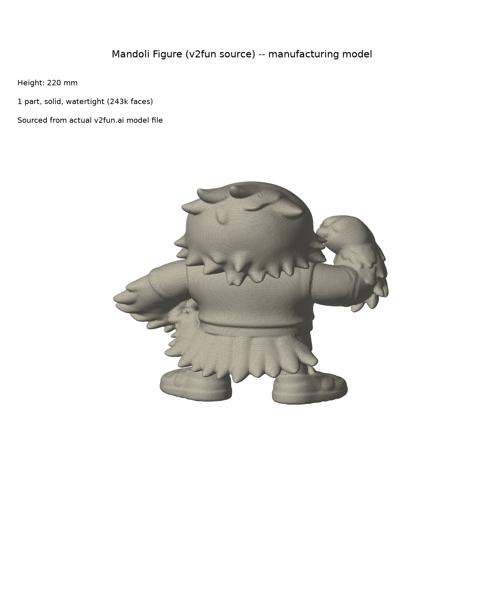

# 만돌이(Mandoli) 마스코트 피규어 — 3D 제작용 모델

보내주신 **v2fun.ai 원본 3D 파일(OBJ)**을 실제 3D 프린팅이 가능한 **1파트 솔리드 STL**로
가공했습니다. 이번엔 사진을 보고 새로 만든 게 아니라, **원본 지오메트리 자체를 그대로
사용**했기 때문에 디테일(깃털, 조끼 리브, 방패 엠블럼, 표정 등)이 원본과 동일합니다.



## 무엇이 달라졌나 (이전 버전과 비교)

이전 버전은 원본 3D 파일 없이 사진만 보고 도형을 조합해서 근사하게 만든 것이라 실루엣만
비슷했습니다. 이번에 보내주신 `.obj`/`.mtl` 파일은 v2fun.ai가 실제로 생성한 지오메트리라서,
**원본 스컬프트를 그대로 프린트 가능한 형태로 다듬기만** 하면 됐습니다. 결과물은 원본과
사실상 동일합니다 (색상 정보만 제외 — 이유는 아래 참고).

## 원본 파일의 문제와 처리 과정

v2fun.ai가 내보낸 원본 OBJ는 그 자체로는 3D 프린팅이 불가능한 상태였습니다:

- 약 300개의 서로 분리된 조각(깃털 하나하나, 손가락 하나하나 등)으로 구성되어 있고,
  **어느 조각도 완전히 밀폐(watertight)되어 있지 않았습니다** — 즉 "속이 빈 껍데기"가
  아니라 두께 없는 열린 면들의 집합이라 그대로는 프린트/견적이 불가능합니다.

처리 과정 (`scripts/process_v2fun_source.py`):
1. 노이즈성 파편(10면 미만의 초소형 조각, 57개) 제거
2. **PyMeshLab의 균일 리샘플링(SDF 오프셋 기반)**으로 300개 조각을 하나의 완전히 밀폐된
   솔리드로 재구성 — 깃털·리브·엠블럼 등 디테일은 유지하면서 실제로 "속이 꽉 찬" 형태로
   변환
3. 좌표계를 Y-up(원본) → Z-up(3D 프린팅 표준)으로 회전, 발밑을 바닥(z=0)에 맞춤
4. 전체 높이 220mm로 스케일 조정

결과: **243,056개 삼각형, 완전 밀폐 솔리드(`is_watertight = True`), 1파트**.

## ⚠️ 색상에 대해

STL 포맷은 색상/텍스처를 담을 수 없어 **형상만** 저장됩니다. 보내주신 `material.mtl`이
참조하는 `texture_20250901.png` 파일 자체는 받지 못해서(채팅에 미리보기 이미지만 표시되고
실제 파일은 첨부되지 않음), 색이 입혀진 버전은 만들 수 없었습니다.

**풀컬러로 만들고 싶으시다면** 다음 중 하나가 필요합니다:
1. `texture_20250901.png` 파일을 직접 보내주시면, 텍스처를 입힌 컬러 GLB(풀컬러 프린팅
   업체용)를 추가로 만들어드릴 수 있습니다.
2. 흑백/단색 프린트 후 사진을 참고해 직접 도색

## 포함된 파일

```
3d-models/mandoli-figure/
├── source/
│   ├── mandoli_v2fun_source.obj   # 보내주신 v2fun.ai 원본 OBJ (가공 전)
│   └── material.mtl                # 원본 머티리얼 정의 (텍스처 파일은 없음)
├── stl/
│   └── mandoli_figure.stl          # 가공 완료된 프린트용 STL (1파트, 220mm, 워터타이트)
├── scripts/
│   └── process_v2fun_source.py     # 원본 OBJ -> 프린트용 STL 가공 스크립트
└── preview/
    └── hero.png                     # 렌더 미리보기 이미지
```

## 실물 사양

| 항목 | 값 |
|---|---|
| 전체 높이 | 220 mm |
| 파츠 수 | 1개 (완전 밀폐 솔리드) |
| 삼각형 수 | 약 243,000개 |
| 워터타이트 여부 | `is_watertight = True` |

## 업체에 제작 의뢰 시 참고 사항

- STL은 3D 프린팅 견적/발주에 가장 일반적인 표준 포맷이며, 완전히 밀폐된 단일 솔리드라
  추가 설명 없이 바로 사용 가능합니다.
- 깃털 끝·손가락 등 얇고 돌출된 부분이 많아 서포트가 필요합니다. **레진(SLA/DLP)
  프린터**가 이런 세밀한 디테일을 살리기에 가장 적합합니다.
- 도색 참고용으로 채팅에서 보내주신 컬러 사진(흰 몸통, 남색 조끼, 파란 날개손, 노란
  부리/신발 포인트)을 업체에 함께 전달해주세요.

## 모델 재생성/수정하는 법

```bash
cd 3d-models/mandoli-figure/scripts
pip install numpy trimesh pymeshlab
python3 process_v2fun_source.py
```

`TARGET_HEIGHT_MM`으로 크기를, `CELLSIZE_PCT`로 디테일 대비 처리 속도(값이 작을수록
디테일이 살지만 느려지고, 너무 작으면 워터타이트가 깨질 수 있음)를 조정할 수 있습니다.
