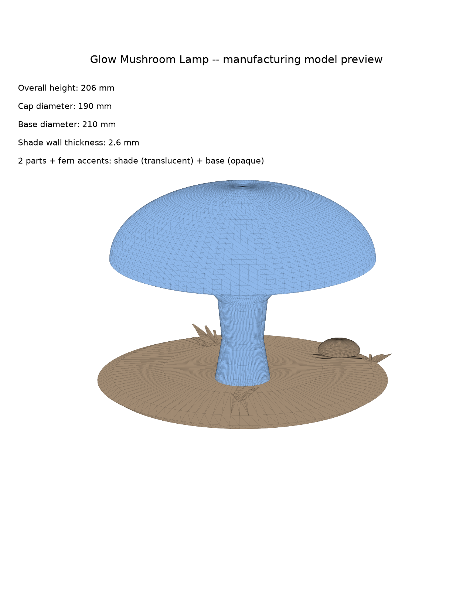

# Glow Mushroom Lamp — 3D 제작용 모델

첨부해주신 Tripo Studio 쇼케이스 영상(빛나는 보라/청색 버섯 램프)을 바탕으로,
실제로 3D 프린팅 업체에 제작을 의뢰할 수 있는 **진짜 3D 모델(STL)**을 만들었습니다.



## 포함된 파일

```
3d-models/mushroom-lamp/
├── stl/
│   ├── shade.stl              # 큰 버섯 갓 + 기둥 (반투명, 조명이 들어가는 부분)
│   ├── base.stl                # 돌 받침대 + 작은 버섯 장식 + 전장부 공간
│   └── assembly_preview.glb    # 두 파츠를 조립한 모습 미리보기 (3D 뷰어/블렌더용, 인쇄용 아님)
├── scripts/
│   └── generate_lamp.py        # 이 모델을 만든 파라메트릭 생성 스크립트 (Python + trimesh)
└── preview/
    └── hero.png                 # 렌더 미리보기 이미지
```

## 실물 사양

| 항목 | 값 |
|---|---|
| 전체 높이 (받침대 포함) | 약 206 mm |
| 갓(캡) 지름 | 190 mm |
| 받침대 지름 | 210 mm |
| 쉐이드(갓+기둥) 벽 두께 | 2.6 mm |
| 기둥 하단 소켓 지름 | 41.2 mm (받침대 보스에 끼움 방식) |
| 받침대 내부 공간(LED 드라이버/배터리) | 지름 84 mm × 깊이 ~16 mm, 바닥 두께 3.5 mm |
| 케이블 인출 구멍 | 지름 4 mm, 받침대 옆면 |

전체를 **2개 파츠**로 나눠 설계했습니다 (조명 제품 실무에서 흔한 구성):

1. **`shade.stl` (쉐이드)** — 버섯 갓과 기둥을 한 몸으로 뚫린 셸(shell) 형태로 제작.
   바닥이 뚫려 있어 LED 퍽/모듈을 아래에서 밀어 넣을 수 있습니다.
   **반투명 레진 또는 반투명 PLA**로 출력하면 안에서 LED 빛이 은은하게 퍼져 보입니다.
2. **`base.stl` (받침대)** — 돌 모양 받침대, 작은 버섯 장식과 3곳의 고사리(fern) 잎
   장식이 붙어 있고, 윗면에 쉐이드 기둥이 꽂히는 보스(소켓)가 있습니다. 아래쪽에서
   접근하는 내부 공간에 LED 드라이버/배터리/USB 모듈을 넣고, 별도의 바닥 커버(원판)로
   마감하는 구조입니다. **불투명 소재**(PLA, 레진 등 색상 무관)로 출력하면 됩니다.
   고사리 잎은 얇은 블레이드 형태(두께 1.6mm)라 출력 시 최소 벽 두께를 지원하는
   프린터/소재인지 업체와 확인해 주세요 (너무 얇으면 부러지기 쉬워 레진 출력을 추천).

## 업체에 제작 의뢰 시 참고 사항

- STL은 3D 프린팅 견적/발주에 가장 일반적으로 쓰이는 표준 포맷이라 대부분의 업체에서
  바로 사용 가능합니다.
- `shade.stl`은 **워터타이트(완전 밀폐)가 아닌, 바닥이 열린 셸** 구조입니다 — 이는 의도된
  디자인입니다 (컵/화병처럼 한쪽이 열린 형태). 슬라이서에서 "vase mode" 또는 일반 셸
  프린트로 정상 처리됩니다. 업체에 문의 시 "바닥이 개방된 셸 구조, 의도된 디자인"이라고
  전달해 주세요.
- `base.stl`은 완전히 밀폐된 솔리드입니다 (`is_watertight = True` 확인 완료).
- 추천 소재: 쉐이드 = 반투명 레진(SLA/DLP) 또는 반투명/우유빛 PLA(FDM), 받침대 = 일반
  PLA/PETG 또는 레진.
- 추천 LED: 따뜻한 보라/청색 컬러의 소형 LED 퍽 또는 COB 스트립 (배터리 또는 USB-C
  전원), 밝기·색은 실제 발광 확인 후 조정 권장.
- 기둥 소켓은 억지끼움(프릭션 핏) 기준으로 설계했습니다. 실제 프린터 공차에 따라
  ±0.2~0.3 mm 조정이 필요할 수 있어, 업체에 조립 방식(끼움/본드/나사)을 함께 상의하시는
  걸 추천합니다.

## 원본 영상과의 차이 (의도적 단순화)

원본 Tripo Studio 영상은 여러 개의 버섯 군집, 이끼, 고사리, 반점 텍스처, 불규칙한 바위
받침대까지 표현된 고polygon 아트워크입니다. 이번 모델은 **실제로 인쇄·제작 가능한 형태**를
우선순위로 두고 다음과 같이 단순화했습니다:

- 버섯 2개 (큰 것 1개 + 작은 장식 1개), 고사리 3다발(포기)로 구성 — 이끼 질감은 생략
- 갓 표면의 반점 무늬는 생략 (원한다면 도색으로 표현하거나, 추가 요청 시 형상에 엠보싱
  패턴을 넣는 것도 가능합니다)
- 받침대는 매끈한 원형 돌 형태 (불규칙한 바위 형태로 조각하는 건 업체/조각가의 후가공
  영역으로 남겨두었습니다)

## 모델 재생성/수정하는 법

```bash
cd 3d-models/mushroom-lamp/scripts
pip install numpy trimesh manifold3d
python3 generate_lamp.py
```

`generate_lamp.py` 안의 숫자들(반지름, 높이, 벽 두께 등)을 바꾸면 형태/크기를 쉽게
조정할 수 있습니다. 모든 치수는 mm 단위입니다.
